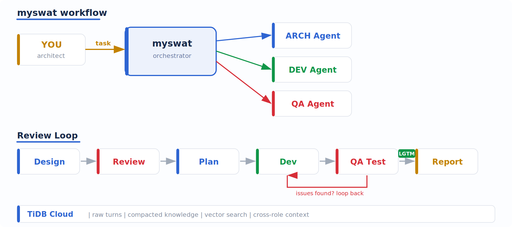

<p align="center">
  <br/>
  <strong>Multi-AI agent conversation orchestrator for software development.</strong><br/><br/>
  
  
  
  
</p>

---

You have a codebase. You have AI agents that can write code and review it. But you're still the one copying outputs between them, deciding who goes next, and re-explaining context every session.

**MySwat automates that.** It routes prompts between agents, persists everything to a shared knowledge base, and loops dev/QA review cycles until LGTM — while you stay in the architect seat.

<p align="center">
  
</p>

## Why MySwat

**You architect. Agents build and review. MySwat connects them.**

- **Automated review loops** — developer proposes, QA reviews, iterate until LGTM. No manual copy-paste.
- **Shared project memory** — every agent sees what others said and learned. Knowledge compounds across sessions, not just within one.
- **Mix any AI backend** — Claude Opus for QA, GPT for dev, Kimi for a second opinion. Per-role configuration.
- **Full workflow or pick stages** — run the whole pipeline (architect-led design → plan → develop → test → report), or just `--develop`/`--dev` or `--test`.
- **Learns your project** — build commands, test tiers, invariants, conventions. Agents stop guessing.

## Quick Start

```bash
# Install (auto-creates venv on first run)
./myswat --help

# Set up a project
myswat init "my-project" --repo /path/to/repo
myswat learn -p my-project

# Run a task — full architect-led workflow
myswat work -p my-project "Implement bloom filter for compaction"

# Or just chat
myswat chat -p my-project
```

## How It Works

```
 You (architect)
  |
  |  "Implement bloom filter for compaction"
  v
 MySwat ──────────────────────────────────────────────
  |                                                    |
  |  1. Loads project knowledge from TiDB              |
  |  2. Architect leads design + planning              |
  |  3. Developer implements in phases                 |
  |  4. QA reviews, tests, loops fixes if needed       |
  |  5. Final report + persisted team knowledge        |
  |                                                    |
 ──────────────────────────────────────────────────────
```

## Workflow Modes

| Goal | Chat delegation | CLI | Result |
|------|-----------------|-----|--------|
| Review design + plan | `MODE: design` | `myswat work --design` | Reviewed design package, no code |
| Implement settled design | `MODE: develop` | `myswat work --develop` | Phased implementation with QA review |
| Run end-to-end delivery | `MODE: full` | `myswat work` | Architect-led design, implementation, QA test, final report |
| Formalize test plan | `MODE: testplan` | _chat-led only_ | Reviewed test plan, no execution |

Internal engine-only modes: `architect_design` and `testplan_design`. They power chat-led orchestration flows and are not user-facing CLI/delegation values.

MySwat does **not** run builds or tests — the agents do that themselves via their terminal access. MySwat handles routing, context, and persistence.

## What Agents Remember

Every conversation is persisted to TiDB and searchable:

- **Session turns** — raw conversation history, cross-role visible
- **Compacted knowledge** — AI-distilled insights from past sessions (architecture decisions, bug fixes, patterns, failure modes)
- **Ingested documents** — your docs and source code, chunked and indexed
- **Project ops** — build commands, test tiers, conventions (via `myswat learn`)

Search across all of it:

```bash
myswat search "transaction isolation" -p my-project
```

## Prerequisites

- Python 3.12+
- [TiDB Cloud](https://tidbcloud.com) account (free tier works)
- At least one AI CLI: [Codex](https://github.com/openai/codex), [Claude Code](https://claude.com/claude-code), or [Kimi](https://www.kimi.com/code)

## Documentation

- [Configuration](docs/configuration.md) — config file, environment variables, per-backend setup
- [CLI Reference](docs/cli-reference.md) — all commands, work modes, chat commands
- [Architecture](docs/architecture.md) — components, memory tiers, knowledge pipeline, TiDB schema

## License

MIT
