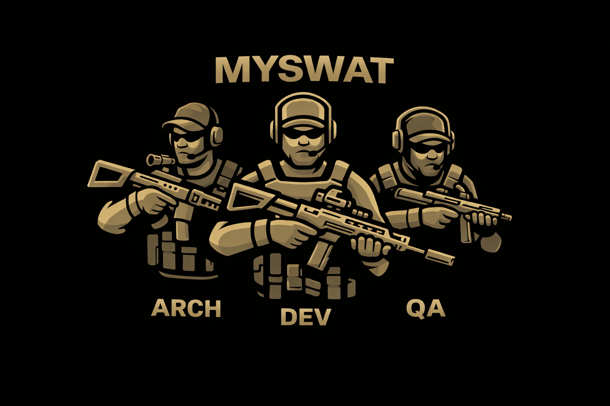
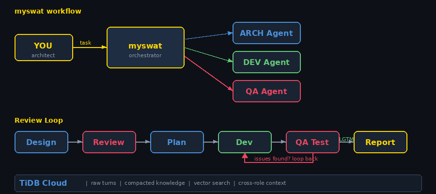

<p align="center">
  
</p>

<p align="center">
  <strong>Multi-AI agent conversation orchestrator for software development.</strong><br/>
  Route prompts, capture diffs, loop until LGTM — humans architect, AI agents build and review.
</p>

<p align="center">
  
  
  
  
</p>

---

## What is MySwat?

MySwat is a **conversation orchestrator** — it automates the copy-paste routing between AI agents (developer and QA review loops) that humans currently do manually. MySwat routes outputs, captures context, and loops until LGTM. It does **not** run builds or tests itself — that's the agents' job.

<p align="center">
  
</p>

## Key Features

- **Conversation persistence** — all turns persisted to TiDB, never deleted on close. Cross-role context restored on session start.
- **Project-scoped memory** — every role (architect, dev, QA) sees each other's recent 10 turns. No more siloed agents.
- **Lazy GC with grace period** — raw turns kept for 7 days after compaction. `myswat gc` reclaims storage safely.
- **Multi-agent review loops** — developer proposes, QA reviews, iterate until LGTM with structured verdicts.
- **Full teamwork workflow** — auto-continue through design review, planning, phased implementation, and GA testing.
- **Selective work modes** — `--design` for design+planning only, `--dev` for phased implementation, `--test` for GA testing.
- **Knowledge compaction** — sessions distilled into reusable knowledge entries stored in TiDB, not raw transcripts.
- **Claude + Codex + Kimi backends** — mix and match AI backends per role (e.g., Claude Opus for QA, GPT-5 for dev).
- **Project learning** — `myswat learn` teaches agents build commands, test tiers, conventions, and invariants.
- **Interactive long-task monitor** — live progress display with stage, TODOs, issues, and `ESC` to cancel.
- **CLAUDE.md / AGENTS.md aware** — extracts project conventions from AI instruction files.

## Recent Updates

### Conversation Persistence Model (v0.7)

The memory system has been redesigned from the ground up:

- **No more turn deletion on close** — raw turns stay until GC'd after a grace period
- **Cross-role context restore** — new sessions pre-load 10 recent turns per role across the entire project, not just the current agent's history
- **Compaction threshold raised to 50 turns** (from 10 turns / 5K tokens) — less aggressive, more useful compaction
- **`myswat gc` replaces `myswat memory purge`** — safe, idempotent garbage collection with 7-day grace
- **Watermark decoupled from visibility** — compaction watermark only controls what gets re-compacted, not what agents can see
- **Pre-load hints** — agents told they can query deeper history via CLI, not force-fed everything

### Claude CLI Backend Support

- Full Claude Code subprocess integration alongside Codex and Kimi
- Per-role backend configuration (e.g., Claude Opus for QA, Codex for dev)
- IP-based launch environment validation for Claude sessions
- `--dangerously-skip-permissions` for non-interactive automation (configurable)

### Work Mode System

- `myswat work --design` — design + planning with interactive checkpoints
- `myswat work --dev` — phased implementation, skip design/plan
- `myswat work --test` — GA testing only
- `myswat work --background` — detach and keep running after terminal exits

## Prerequisites

- Python 3.12+
- [TiDB Cloud](https://tidbcloud.com) account (free tier works)
- At least one AI CLI tool: [Codex CLI](https://github.com/openai/codex) (`codex`), Claude Code (`claude`), or Kimi CLI (`kimi`)
- (Optional) `FlagEmbedding` for vector search with BGE-M3

## Installation

```bash
# Self-bootstrapping — auto-creates venv, installs deps on first run
./myswat --help
```

Or manually:

```bash
python3 -m venv .venv
.venv/bin/pip install pymysql pydantic pydantic-settings "typer[all]" rich prompt_toolkit
.venv/bin/pip install --no-deps -e .
```

## Configuration

Create `~/.myswat/config.toml`:

```toml
[tidb]
host = "your-tidb-host.tidbcloud.com"
port = 4000
user = "your_user"
password = "your_password"
ssl_ca = "/etc/ssl/certs/ca-certificates.crt"

[agents]
codex_path = "codex"
claude_path = "claude"
kimi_path = "kimi"
claude_required_ip = "your_claude_cli_ip"
architect_backend = "codex"
developer_backend = "codex"
qa_main_backend = "claude"
qa_vice_backend = "kimi"
architect_model = "gpt-5.4"
developer_model = "gpt-5.4"
qa_main_model = "claude-opus-4-6"
qa_vice_model = "kimi-code/kimi-for-coding"
```

Or use environment variables: `MYSWAT_TIDB_HOST`, `MYSWAT_TIDB_PASSWORD`, etc.

To use Claude for all roles:

```toml
[agents]
architect_backend = "claude"
developer_backend = "claude"
qa_main_backend = "claude"
qa_vice_backend = "claude"
claude_path = "claude"
architect_model = "claude-sonnet-4-6"
developer_model = "claude-sonnet-4-6"
qa_main_model = "claude-opus-4-6"
qa_vice_model = "claude-sonnet-4-6"
```

When using Claude, MySwat validates the launch environment before every `claude` subprocess start: both `http_proxy` and `https_proxy` must be set, and `curl ipinfo.io` must report the configured IP. If that check fails, the workflow aborts before Claude is started.

By default, Claude runners add `--dangerously-skip-permissions` for non-interactive automation. Override `claude_default_flags` for a different permission model.

## Quick Start

### 1. Initialize a project

```bash
myswat init "my-project" --desc "Project description" --repo /path/to/repo
```

Creates the database schema, project record, and seeds 4 default agent roles (architect, developer, qa_main, qa_vice).

### 2. Learn the project

```bash
myswat learn -p my-project
```

The architect agent scans indicator files (Makefile, Cargo.toml, package.json, CI configs, CLAUDE.md, etc.) and extracts structured knowledge about build commands, test tiers, git workflow, code style rules, and invariants.

### 3. Interactive chat

```bash
myswat chat -p my-project
```

REPL with role switching (`/role developer`), inline review (`/review "task"`), and persistent sessions. Long-running `/work` and `/review` tasks show a live monitor with current stage, TODOs, and `ESC` to cancel.

### 4. Run a task

```bash
# Single agent
myswat run --single -p my-project "Implement feature X"

# Developer + reviewer loop
myswat run -p my-project "Add error handling to the parser"
```

### 5. Full teamwork workflow

```bash
# Full workflow (default): design -> review -> plan -> dev -> GA test -> report
myswat work -p my-project "Implement bloom filter for compaction"

# Design + planning only
myswat work -p my-project --design "Implement bloom filter for compaction"

# Development only (skip design/plan)
myswat work -p my-project --dev "Implement bloom filter for compaction"

# GA testing only
myswat work -p my-project --test "Validate bloom filter correctness"

# Detach and keep running
myswat work -p my-project --background "Implement bloom filter for compaction"

# Monitor or stop
myswat task 42 -p my-project
myswat stop 42 -p my-project
```

| Mode | Flags | Stages | Success criteria |
|------|-------|--------|------------------|
| `full` | _(default)_ | design, design review, plan, plan review, phased dev, GA test, report | all phases committed AND GA passed |
| `design` | `--design`, `--plan` | design, design review, plan, plan review, report | both reviews passed |
| `development` | `--development`, `--dev` | phased dev (with informational QA review), report | all phases committed |
| `test` | `--test`, `--ga-test` | GA test plan/review, execute tests, bug fixes, report | GA passed |

### 6. Feed documents

```bash
myswat feed /path/to/docs -p my-project --glob "**/*.md"
myswat feed /path/to/src -p my-project --glob "**/*.rs"
```

### 7. Search knowledge

```bash
myswat memory search "transaction isolation" -p my-project
```

## CLI Reference

| Command | Description |
|---------|-------------|
| `myswat init <name> [-r repo] [-d desc]` | Initialize a project |
| `myswat learn -p <slug> [-w workdir]` | Learn project build/test/conventions |
| `myswat chat -p <slug> [--role R]` | Interactive chat session |
| `myswat run <task> -p <slug> [--single] [--role R] [--reviewer R]` | Run agent task |
| `myswat work <req> -p <slug> [--background] [--design\|--dev\|--test]` | Full or selective teamwork workflow |
| `myswat feed <path> -p <slug> [--glob pattern]` | Ingest documents into knowledge |
| `myswat status -p <slug>` | Show project status |
| `myswat task <id> -p <slug>` | Show detailed status for one work item |
| `myswat stop <id> -p <slug>` | Stop a background workflow |
| `myswat gc -p <slug> [--grace-days N]` | Garbage-collect compacted turns |
| `myswat history -p <slug> [--turns N]` | Show raw recent turns |
| `myswat memory search <query> -p <slug>` | Search knowledge base |
| `myswat memory add <title> <content> -p <slug> [-c cat]` | Add knowledge manually |
| `myswat memory list -p <slug> [-c category]` | List knowledge entries |
| `myswat memory compact -p <slug>` | Compact sessions into knowledge |

## Architecture

| Component | Role |
|-----------|------|
| **CLI** (Typer) | `myswat init`, `learn`, `chat`, `run`, `work`, `gc` |
| **SessionManager** | Agent lifecycle, subprocess launch (codex/claude/kimi) |
| **WorkflowEngine** | Mode dispatch: full, design, development, test |
| **MemoryRetriever** | 4-tier context: project_ops → recent turns → knowledge → hints |
| **MemoryStore** | TiDB CRUD (sessions, turns, knowledge, work items) |
| **KnowledgeCompactor** | Distill session turns into reusable knowledge entries |
| **Embedder** | BGE-M3 local embeddings for vector search (optional) |
| **GC** | Lazy garbage collection with 7-day grace period |

### Conversation Persistence Lifecycle

```
Session active
  |
  +-- All turns saved to session_turns (always)
  |
  +-- At 50 uncompacted turns --> mid-session compaction
  |     +-- AI extracts knowledge, advance watermark
  |     +-- Raw turns stay (visible for pre-load)
  |
  +-- Session close
  |     +-- status = 'completed', run final compaction
  |     +-- If fully compacted: status = 'compacted', set compacted_at
  |     +-- Raw turns NOT deleted
  |
  +-- GC (myswat gc, separate pass)
        +-- Deletes turns from compacted sessions past grace period
        +-- Keeps most recent 50 turns per project regardless
        +-- Session rows never deleted (FK safety)
```

### TiDB Schema

| Table | Purpose |
|-------|---------|
| `projects` | Project registry |
| `agents` | Role configs per project |
| `sessions` | Dialog sessions with compaction watermark + `compacted_at` |
| `session_turns` | Individual messages (recency-indexed) |
| `knowledge` | Compacted/ingested knowledge with VECTOR(1024) |
| `work_items` | Task tracking |
| `artifacts` | Proposals/diffs under review |
| `review_cycles` | Review iterations with structured verdicts |

## Target Use Cases

MySwat is designed for large, complex codebases where coordinated multi-agent development shines:

- **Rust systems** — TiSql (51K lines, 18 invariants, segmented Makefile)
- **Distributed databases** — TiDB (Go), TiKV (Rust)
- **Any project with CI gates** — agents learn your test tiers and respect them

## License

MIT
